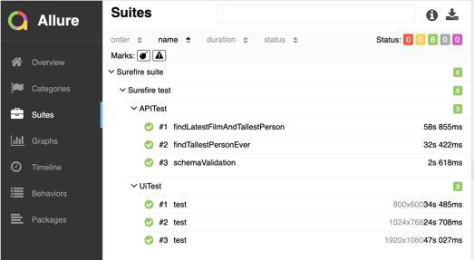

# Running Tests with Java, Maven, and TestNG

This guide provides instructions on how to run tests.

## Prerequisites

- [Java 17](https://adoptium.net/) installed
- [Maven](https://maven.apache.org/download.cgi) installed
- [Allure](https://docs.qameta.io/allure/#_installing_a_commandline) installed
- macOS LTS operating system

## Steps

1. **Clone the Repository:**
   ```bash
   git clone git@github.com:msulaev/xm.git
   cd xm
   
2. **Run test:**
   ```bash
   maven clean test
   ```
3. **Generate Allure report:**
   ```bash
   allure serve target/allure-results
   ```
### Report example
